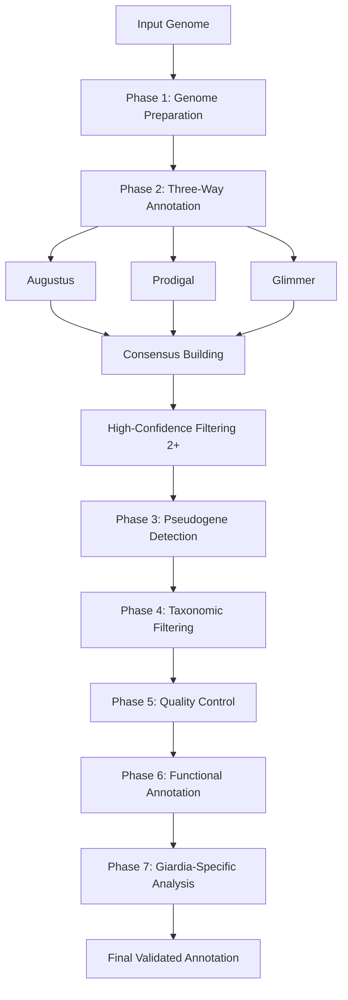

# Giardia Genome Annotation Pipeline v5.0

[](https://opensource.org/licenses/MIT)
[]()
[]()

A comprehensive, production-ready annotation pipeline for *Giardia* genomes featuring **three-way consensus** structural annotation with robust error handling and quality control.

---

## 🔬 Overview

This pipeline provides high-quality genome annotation for *Giardia* species through:

- **Three-way structural annotation**: Augustus + Prodigal + Glimmer
- **High-confidence filtering**: Requires 2+ predictor agreement
- **Pseudogene detection**: Identifies truncated and non-functional genes
- **Taxonomic filtering**: Removes bacterial/viral contamination
- **Functional annotation**: SwissProt and Pfam domain predictions
- **Giardia-specific analysis**: VSP candidate identification
- **Comprehensive QC**: BUSCO assessment and validation at every step

### Why This Pipeline?

- ✅ **Production-ready**: Extensively tested and debugged
- ✅ **Robust**: Comprehensive error handling and validation
- ✅ **Accurate**: Three-way consensus reduces false positives
- ✅ **Complete**: From raw genome to final annotations in one run
- ✅ **Giardia-optimized**: Species-specific parameters and analysis

---

## 📊 Expected Results

| Species | Total Genes | High-Confidence | Pseudogenes | VSP Candidates | BUSCO* |
|---------|-------------|-----------------|-------------|----------------|--------|
| *G. intestinalis* | ~5,100 | ~4,500-4,800 | 200-300 | 80-150 | 18-24% |
| *G. muris* | ~4,660 | ~4,000-4,300 | 150-200 | 60-100 | 15-22% |

*\*Low BUSCO scores (18-24%) are EXPECTED and NORMAL for Giardia due to evolutionary divergence.*

---

## 🚀 Quick Start

### Prerequisites

**Required tools:**
- Augustus (with Giardia model)
- Prodigal
- Glimmer3
- DIAMOND
- gffread
- Python 3.6+
- Biopython

**Optional tools:**
- BUSCO (for quality assessment)
- HMMER (for Pfam domains)

### Installation

```bash
# Clone the repository
git clone https://github.com/ptemidayo/giardia-annotation-pipeline.git
cd giardia-annotation-pipeline

# Make script executable
chmod +x giardia_annotation_pipeline.sh

# Create directory structure
mkdir -p databases genomes results
```

### Critical: Setup Giardia Protein Database

**The pipeline REQUIRES a Giardia protein database for taxonomic filtering.**

```bash
# Option 1: Download from NCBI (recommended)
cd databases
datasets download genome accession GCA_000002435.1 --include protein
unzip ncbi_dataset.zip
cat ncbi_dataset/data/*/protein.faa > giardia_proteins.fasta
cd ..

# Option 2: Use your own Giardia proteins
cp your_giardia_proteins.faa databases/giardia_proteins.fasta

# Verify database
grep -c '^>' databases/giardia_proteins.fasta
# Should show 4000-6000 proteins
```

### Configuration

Update the Augustus config path in the script (line 245):

```bash
# Find your Augustus config directory
find ~ -name "augustus_config" -type d

# Update in script
nano giardia_annotation_pipeline.sh
# Change: export AUGUSTUS_CONFIG_PATH="/path/to/your/augustus_config"
```

---

## 💻 Usage

### Basic Usage

```bash
./giardia_annotation_pipeline.sh \
    <genome.fasta> \
    <strain_name> \
    [threads] \
    [species]
```

**Parameters:**
- `genome.fasta` - Genome file (must be in `genomes/` directory)
- `strain_name` - Unique identifier for this strain
- `threads` - Number of CPU threads (default: 8)
- `species` - Species: `intestinalis`, `muris`, or `auto` (default: auto)

### Examples

```bash
# Annotate G. intestinalis with 16 threads
./giardia_annotation_pipeline.sh \
    Giardia_intestinalis_WB.fna \
    GiardiaWB \
    16 \
    intestinalis

# Annotate G. muris with auto-detection
./giardia_annotation_pipeline.sh \
    Giardia_muris_P15.fna \
    GiardiaMuris_P15 \
    16 \
    auto
```

### Batch Processing

```bash
# Process multiple genomes
for genome in genomes/*.fna; do
    strain=$(basename $genome .fna)
    ./giardia_annotation_pipeline.sh \
        $(basename $genome) \
        $strain \
        16 \
        auto
done
```

See [`examples/example_batch_run.sh`](examples/example_batch_run.sh) for more batch processing examples.

---

## 📁 Output Structure

```
results/STRAIN_TIMESTAMP/
├── STRAIN_high_confidence.gff3          # High-confidence genes (2+ predictors)
├── STRAIN_final_proteins.faa            # Final protein sequences
├── STRAIN_final_cds.fna                 # CDS nucleotide sequences
├── STRAIN_annotation.gbk                # GenBank format
├── STRAIN_FINAL_REPORT.txt              # Comprehensive statistics
├── STRAIN_consensus_normalized.gff3     # All consensus predictions
├── STRAIN_consensus_stats.txt           # Predictor support statistics
├── pseudogenes/
│   ├── STRAIN_pseudogenes.faa          # Pseudogene sequences
│   └── STRAIN_functional_genes.faa     # Functional gene sequences
├── taxonomy/
│   ├── STRAIN_taxonomic_analysis.txt   # Contamination assessment
│   └── STRAIN_giardia_genes.faa        # Clean Giardia genes
├── functional/
│   ├── STRAIN_swissprot.tsv            # SwissProt annotations
│   └── STRAIN_pfam_domains.txt         # Pfam domain predictions
└── giardia_specific/
    └── STRAIN_vsp_candidates.tsv        # VSP candidate proteins
```

---

## 🔍 Pipeline Workflow



### Pipeline Phases

1. **Genome Preparation** - Statistics, BUSCO on assembly
2. **Three-Way Structural Annotation** - Augustus, Prodigal, Glimmer
3. **Pseudogene Detection** - Identify non-functional genes
4. **Taxonomic Filtering** - Remove contaminants (REQUIRED Giardia DB)
5. **Quality Control** - Length filtering, validation
6. **Functional Annotation** - SwissProt, Pfam domains
7. **Giardia-Specific Analysis** - VSP identification
8. **Comprehensive Validation** - All files checked
9. **Output Generation** - CDS, GenBank, reports
10. **Final Report** - Complete statistics

---

## 📖 Documentation

- **[Quick Start Guide](docs/QUICK_START.md)** - Detailed setup and usage instructions
- **[Version 5.0 Corrections](docs/CORRECTIONS_v5.0.md)** - Technical details on improvements
- **[Troubleshooting](docs/QUICK_START.md#troubleshooting)** - Common issues and solutions

---

## 🔧 Features in v5.0

### What's New

✅ **Improved Glimmer Training** - Multiple reference CDS locations, validation, automatic fallback  
✅ **Fixed GenBank Generation** - Single clean execution, proper error handling  
✅ **Enhanced BUSCO Extraction** - Robust percentage extraction with fallbacks  
✅ **Streamlined Taxonomic Filtering** - Clear decision logic, mandatory Giardia database  
✅ **Comprehensive Validation** - All output files checked with clear status  
✅ **Better Error Handling** - Extensive checks with informative messages  

### Core Features (All Versions)

- Three-way consensus annotation (Augustus + Prodigal + Glimmer)
- High-confidence filtering (2+ predictor agreement)
- Scaffold name normalization (prevents gffread errors)
- Species-specific parameters (*G. intestinalis* vs *G. muris*)
- Intron-aware prediction (Augustus)
- Conservative consensus algorithm (60% overlap, 2x size limit)

---

## ⚠️ Important Notes

### Low BUSCO Scores are Normal!

*Giardia* genomes typically show **18-24% BUSCO completeness**. This is **EXPECTED and NORMAL** due to:
- Evolutionary divergence from other eukaryotes
- Genome reduction and compaction
- Unique metabolic pathways
- Minimal intracellular machinery

**Do not be alarmed by low BUSCO scores!** They do not indicate poor annotation quality.

### Database Requirements

The **Giardia protein database is MANDATORY**. The pipeline will exit if not found. This ensures accurate taxonomic filtering and contamination detection.

---

## 🐛 Troubleshooting

### Common Issues

**"Giardia database not found"**
```bash
# Create the database as shown in Quick Start
# Verify: ls -lh databases/giardia_proteins.fasta
```

**"Augustus config path not found"**
```bash
# Find your config: find ~ -name "augustus_config" -type d
# Update line 245 in the script
```

**"Glimmer training failed"**
```bash
# Provide reference CDS or pipeline will use automatic genome-based training
```

**Low gene count after filtering**
```bash
# Check validation log: cat STRAIN_validation.log
# Review taxonomic analysis: cat results/*/taxonomy/*_taxonomic_analysis.txt
```

See the [Quick Start Guide](docs/QUICK_START.md#troubleshooting) for more solutions.

---

## 📊 Quality Metrics

The pipeline generates comprehensive quality metrics:

- **Gene count validation** - Comparison to expected counts
- **BUSCO completeness** - Assembly and gene set quality
- **Functional coverage** - % genes with SwissProt hits
- **Pseudogene rate** - % non-functional genes
- **Contamination rate** - % potential contaminants removed
- **Predictor agreement** - Consensus support levels

Check `STRAIN_FINAL_REPORT.txt` for all metrics.

---

## 🤝 Contributing

Contributions are welcome! Please:

1. Fork the repository
2. Create a feature branch (`git checkout -b feature/improvement`)
3. Commit your changes (`git commit -am 'Add new feature'`)
4. Push to the branch (`git push origin feature/improvement`)
5. Open a Pull Request

---

## 📜 Citation

If you use this pipeline in your research, please cite:

```
Temidayo Oluyomi Elufisan (2025). Giardia Genome Annotation Pipeline v5.0. 
GitHub: https://github.com/ptemidayo/giardia-annotation-pipeline
```

And cite the tools used:
- **Augustus**: Stanke et al. (2006) Bioinformatics
- **Prodigal**: Hyatt et al. (2010) BMC Bioinformatics
- **Glimmer**: Delcher et al. (2007) Bioinformatics
- **DIAMOND**: Buchfink et al. (2015) Nature Methods
- **BUSCO**: Simão et al. (2015) Bioinformatics

---

## 📝 License

This project is licensed under the MIT License - see the [LICENSE](LICENSE) file for details.

---

## 👥 Authors

- **Temidayo Oluyomi Elufisan** - *Pipeline development and debugging*
- Original concepts based on standard genome annotation workflows

---

## 🙏 Acknowledgments

- Augustus, Prodigal, and Glimmer3 development teams
- NCBI for reference genomes and protein databases
- *Giardia* research community

---

## 📞 Support

For issues, questions, or suggestions:
- Open an [Issue](https://github.com/ptemidayo/giardia-annotation-pipeline/issues)
- Check the [Quick Start Guide](docs/QUICK_START.md)
- Review [Troubleshooting](docs/QUICK_START.md#troubleshooting)

---

**Version**: 5.0 (Production Ready)  
**Status**: ✅ Fully tested and debugged  
**Last Updated**: November 2025  

---

*Optimized for Giardia intestinalis and Giardia muris genome annotation* 🦠
